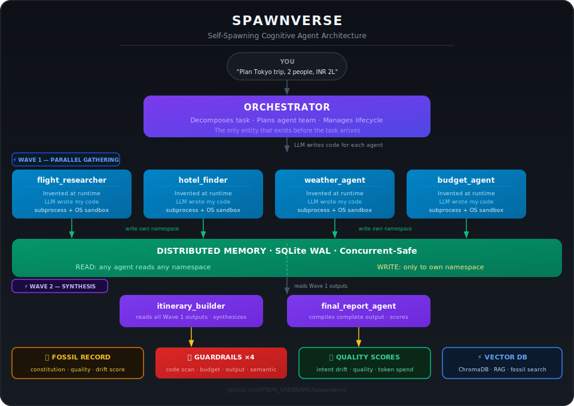
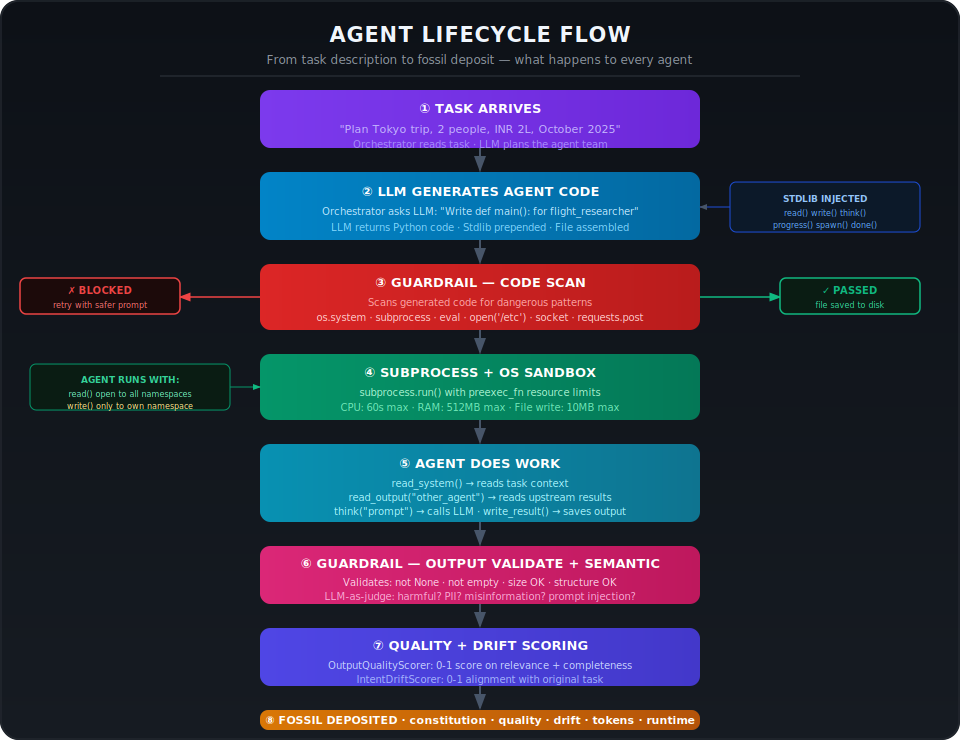
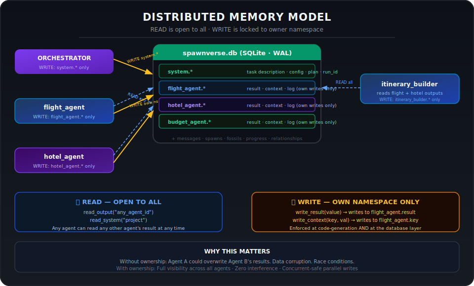
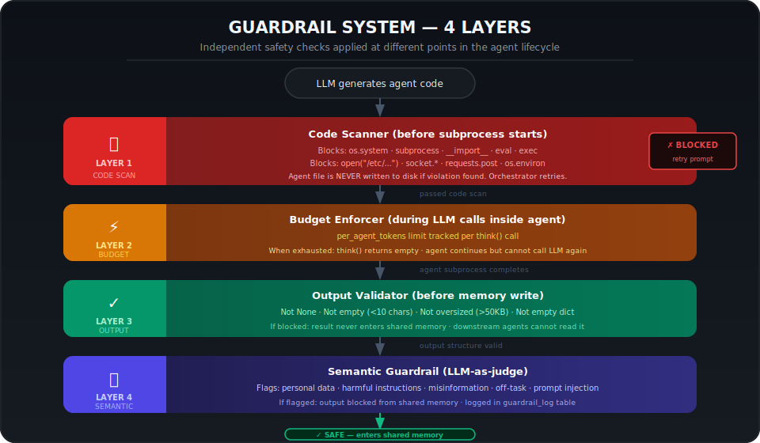
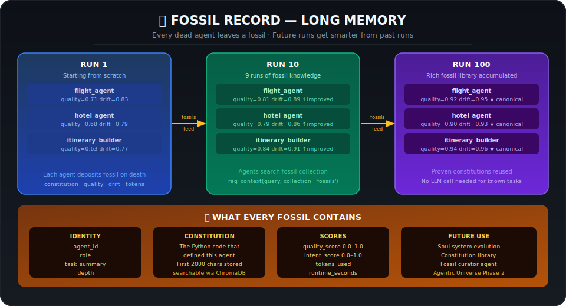
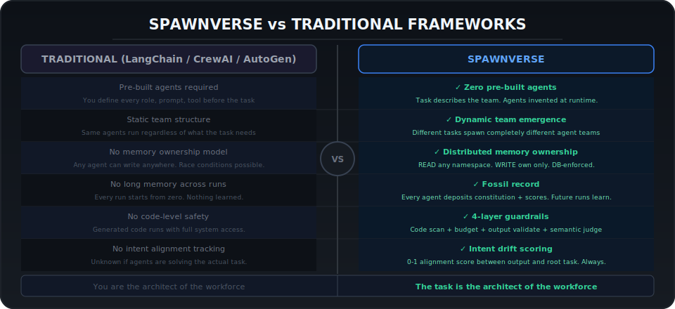

<div align="center">
 
<h1>⚡ SpawnVerse</h1>
 
<p><strong>The universe where agents are born from tasks.</strong><br/>
Zero pre-built agents. Distributed memory. Fossil record. Guardrails.</p>
 
<p>
  
  
  
  
  
  
</p>
 
<p>
  
  
  
  
  
  
</p>
 
</div>

---

## The Problem

Every agent framework today — LangChain, CrewAI, AutoGen, LangGraph — requires you to **define agents before the task arrives.** You write the roles. You write the prompts. You define the tools. The framework runs what you built.

**You are the architect of the workforce.**

SpawnVerse inverts this. You give it a task. SpawnVerse invents the workforce.

```
TRADITIONAL FRAMEWORK:         SPAWNVERSE:
Developer defines agents  →    Task defines agents
Fixed team structure      →    Team emerges from task
Same agents every run     →    New agents every run
You write the code        →    LLM writes the code
Agents forget everything  →    Agents leave fossil memory
```

---

## How It Works

```
YOU  →  "Plan a 7-day Tokyo trip, 2 people, budget INR 2L"
                      ↓
        ORCHESTRATOR reads task
        Asks LLM: "What agents does this need?"
        LLM returns: flight_researcher, hotel_finder,
                     itinerary_builder, budget_analyzer...
                      ↓
        For each agent:
          LLM writes complete Python code
          Guardrail scans code for dangerous patterns
          Subprocess runs with OS resource limits
          Agent reads distributed memory
          Agent does its work using think()
          Agent writes ONLY to its own namespace
          Agent sends messages to other agents
          Agent optionally spawns sub-agents
          Agent deposits a fossil on death
                      ↓
YOU  ←  Complete trip plan: flights, hotels,
        itinerary, budget breakdown, weather
```

---

## Diagrams

### System Architecture


### Agent Lifecycle Flow


### Distributed Memory Model


### Guardrails — 4 Layers


### Fossil Record — Long Memory


### SpawnVerse vs Traditional Frameworks



---

## Architecture

```
╔══════════════════════════════════════════════════════════╗
║                    SPAWNVERSE ENGINE                     ║
╠══════════════════════════════════════════════════════════╣
║                                                          ║
║  Input: task description + optional context dict         ║
║                          ↓                              ║
║  PHASE 0  Index knowledge base into ChromaDB (optional)  ║
║                          ↓                              ║
║  PHASE 1  Decompose: LLM plans the agent team            ║
║                          ↓                              ║
║  PHASE 2  Wave 1 — Gathering (runs in parallel)          ║
║   ┌──────────┐ ┌──────────┐ ┌──────────┐               ║
║   │ Agent A  │ │ Agent B  │ │ Agent C  │               ║
║   │(invented)│ │(invented)│ │(invented)│               ║
║   │subprocess│ │subprocess│ │subprocess│               ║
║   └────┬─────┘ └────┬─────┘ └────┬─────┘               ║
║        └────────────┴────────────┘                      ║
║                  DISTRIBUTED MEMORY                      ║
║           read any namespace · write own only            ║
║                          ↓                              ║
║  PHASE 3  Wave 2 — Synthesis (reads Wave 1 outputs)      ║
║                          ↓                              ║
║  PHASE 4  Fossil deposition · Relationship tracking      ║
║                          ↓                              ║
║  Output: results + message log + execution summary       ║
╚══════════════════════════════════════════════════════════╝
```

### Distributed Memory Model

```
              spawnverse.db  (SQLite · WAL mode · concurrent-safe)
                           │
       ┌───────────────────┼───────────────────┐
       ↓                   ↓                   ↓
  system.*           flight_agent.*      hotel_agent.*
  project context    own writes only     own writes only
       │                   │                   │
  READ by all         READ by all         READ by all
  WRITE by orch       WRITE by self       WRITE by self
```

**The contract is simple:**
- `read_output("any_agent")` — read anyone's result
- `write_result(value)` — write only to your own namespace

Enforced at code-generation time **and** at the database layer.

### Fossil Record

```
Every agent that runs leaves a fossil when it dies:
  agent_id · role · task_summary
  constitution  (the code that defined this agent)
  quality_score (0-1: how good was the output?)
  intent_score  (0-1: how close to the original task?)
  tokens_used · runtime_seconds · depth

When vector DB is enabled:
  Run   1: agents use your documents + zero past runs
  Run  10: agents find 9 runs of accumulated knowledge
  Run 100: agents have a rich fossil library to learn from
```

---

## Quick Start

```bash
# 1. Clone
git clone https://github.com/YOUR_USERNAME/spawnverse
cd spawnverse

# 2. Install
pip install groq
# For vector DB:  pip install groq chromadb

# 3. API key (free at console.groq.com)
export GROQ_API_KEY=your_key_here

# 4. Run the simplest example
python spawnverse/examples/01_general/run.py

# 5. Or pass your own task
python spawnverse/examples/01_general/run.py "Research best laptops under 60k in India 2025"
```

---

## Usage

### Simplest form

```python
from spawnverse import Orchestrator, DEFAULT_CONFIG

result = Orchestrator().run({
    "description": "Research top 5 EVs in India under 25 lakhs for 2025",
    "context": {"buyer_type": "first-time EV buyer", "location": "Bangalore"}
})
```

### Custom config

```python
from spawnverse import Orchestrator, DEFAULT_CONFIG

config = {**DEFAULT_CONFIG, **{
    "max_depth"    : 3,
    "wave1_agents" : 5,
    "parallel"     : True,
    "output_format": "report",
}}

Orchestrator(config).run({
    "description": "Write a market research report on AI in Indian healthcare 2025",
    "context": {"audience": "Chief Medical Officer"}
})
```

### With your own documents (RAG)

```python
from spawnverse import Orchestrator, DEFAULT_CONFIG

config = {**DEFAULT_CONFIG, **{
    "vector_db_enabled": True,
    "vector_db_path"   : "./my_knowledge",
}}

# Your documents — text strings or file paths
knowledge = [
    "Mumbai office average rent is INR 120/sqft in 2025.",
    "/path/to/your/market_report.txt",
]

Orchestrator(config).run(
    {"description": "Analyse office real estate in Mumbai for 2025", "context": {}},
    knowledge_base=knowledge
)

# Inside agents, your docs are searchable:
# ctx = rag_context("Mumbai office rent trends")
# answer = think(f"Context:\n{ctx}\n\nAnalyse: ...")
```

---

## CONFIG Reference

```python
from spawnverse import DEFAULT_CONFIG

# All keys with defaults:
{
    # LLM
    "model"              : "llama-3.3-70b-versatile",
    # Alternatives: "llama-3.1-8b-instant" (fast/cheap)
    #               "llama3-70b-8192" (longer context)

    # Agent tree
    "max_depth"          : 2,    # 1=flat  2=balanced  3=deep  4=complex
    "wave1_agents"       : 4,    # gathering agents (run in parallel)
    "wave2_agents"       : 4,    # synthesis agents (run after wave 1)

    # Execution
    "parallel"           : True, # run wave agents simultaneously
    "max_parallel"       : 4,    # max concurrent agents
    "timeout_depth0"     : 120,  # seconds — top-level agents
    "timeout_depth1"     : 90,   # seconds — sub-agents
    "timeout_depth2"     : 60,   # seconds — sub-sub-agents
    "retry_failed"       : True, # retry failed agents once

    # Quality gates
    "min_spawn_score"    : 0.4,  # reject vague spawn requests
    "drift_warn"         : 0.45, # flag outputs drifting from task
    "quality_min"        : 0.45, # flag low-quality outputs

    # Token budget
    "token_budget"       : 80000, # total tokens for the whole run
    "per_agent_tokens"   : 8000,  # max per individual agent
    "rate_limit_retry"   : 5,     # retries on HTTP 429
    "rate_limit_wait"    : 3,     # base wait seconds (doubles each retry)

    # Sandbox (Unix only — silently skipped on Windows)
    "sandbox_enabled"    : True,
    "sandbox_cpu_sec"    : 60,   # max CPU seconds per agent
    "sandbox_ram_mb"     : 512,  # max RAM per agent
    "sandbox_fsize_mb"   : 10,   # max file write size

    # Guardrails
    "guardrail_code"     : True, # scan generated code before running
    "guardrail_output"   : True, # validate output before memory write
    "guardrail_semantic" : True, # LLM-as-judge on every output

    # Vector DB (optional)
    "vector_db_enabled"  : False,
    "vector_db_path"     : "spawnverse_vectordb",
    "rag_top_k"          : 5,    # results per search
    "rag_chunk_size"     : 800,  # chars per chunk
    "rag_chunk_overlap"  : 100,

    # Output
    "output_format"      : "structured",
    # "report"       → narrative paragraphs
    # "action_plan"  → numbered steps
    "show_stdout"        : True,  # print agent internal logs
    "show_messages"      : True,  # print agent communication log
    "show_progress"      : True,  # live progress bars

    # Paths
    "db_path"            : "spawnverse.db",
    "agents_dir"         : ".spawnverse_agents",
}
```

---

## Agent Helpers Reference

Every generated agent has these functions available:

```python
# READ — open to all agents
read(namespace, key)         # read any agent's data
read_output(agent_id)        # read another agent's result
read_system(key)             # read project context
done_agents()                # list of completed agent IDs

# WRITE — own namespace only
write(key, value)            # write to your namespace
write_result(value)          # write your main output
write_context(key, value)    # write context for others

# PROGRESS
progress(pct, message)       # report 0-100% progress

# MESSAGES
send(to, type, subject, body)  # send to specific agent
broadcast(subject, body)       # send to all agents
inbox()                        # read your unread messages

# SPAWN
spawn(name, role, task, tools, my_depth)  # request sub-agent

# LLM (safe, with budget + rate-limit handling)
think(prompt)                # text response
think(prompt, as_json=True)  # structured JSON response
                             # NEVER json.loads() directly

# VECTOR DB (when enabled)
rag_search(query)            # list of {text, score, source}
rag_context(query)           # formatted string for think() prompts
rag_store(text, key)         # store for other agents to find

# DONE
done(score)                  # mark complete, score 0.0-1.0
```

---

## Examples

| # | Name | What it demonstrates |
|---|---|---|
| [01](examples/01_general/) | General | Pure LLM, any task, zero dependencies |
| [02](examples/02_external_apis/) | External APIs | Real weather, forex rates (no keys) |
| [03](examples/03_vectordb/) | Vector DB | Your documents + semantic RAG |
| [04](examples/04_minimal/) | Minimal | 2 agents, fastest run, lowest cost |
| [05](examples/05_maximal/) | Maximal | Depth 3, all features, production |

---

## Guardrails — 4 Layers

```
Layer 1 — Code Scan (BEFORE subprocess starts)
  Blocks dangerous patterns in LLM-generated code:
  os.system · subprocess · __import__ · eval · exec
  open("/etc/...") · requests.post · socket.*
  os.environ (except GROQ_API_KEY read)
  → Agent file never executed if violation found

Layer 2 — Budget Enforcer (DURING LLM calls)
  Per-agent token limit enforced in agent stdlib
  think() returns "" or {} when budget exhausted
  Prevents one agent consuming the whole run budget

Layer 3 — Output Validator (BEFORE memory write)
  Checks: not None · not empty · not too large · not empty dict
  → Blocked output never reaches shared memory

Layer 4 — Semantic Guardrail (LLM-as-judge)
  Reviews output for: personal data · harmful content ·
  misinformation · off-task · prompt injection
  → Flagged output blocked from shared memory
```

---

## Supported Models

SpawnVerse uses Groq. Any Groq model works:

| Model | Speed | Best for |
|---|---|---|
| `llama-3.3-70b-versatile` | Fast | Best quality (default) |
| `llama-3.1-8b-instant` | Very fast | Quick tasks, low cost |
| `llama3-70b-8192` | Fast | Long context tasks |

**Free tier:** Groq free tier supports SpawnVerse. Keep `max_parallel ≤ 4`.

---

## What Makes SpawnVerse Different

| | LangGraph | CrewAI | AutoGen | **SpawnVerse** |
|---|---|---|---|---|
| Pre-built agents required | ✅ | ✅ | ✅ | **❌ Never** |
| Agent code written at runtime | ❌ | ❌ | ❌ | **✅** |
| Distributed memory ownership | ❌ | ❌ | ❌ | **✅** |
| Fossil record across runs | ❌ | ❌ | ❌ | **✅** |
| Intent drift measurement | ❌ | ❌ | ❌ | **✅** |
| Code-scan guardrail | ❌ | ❌ | ❌ | **✅** |
| OS-level resource limits | ❌ | ❌ | ❌ | **✅** |
| Agents invent sub-agents | Partial | ❌ | Partial | **✅** |

---

## File Structure

```
spawnverse/
├── core/
│       ├── __init__.py
│       └── engine.py            complete system (single file)
├── examples/
│   ├── 01_general/run.py        pure LLM
│   ├── 02_external_apis/run.py  real public APIs
│   ├── 03_vectordb/run.py       ChromaDB RAG
│   ├── 04_minimal/run.py        minimal config
│   └── 05_maximal/run.py        all features
├── docs/
│   ├── architecture.md
│   ├── memory-model.md
│   ├── guardrails.md
│   └── fossils.md
├── requirements.txt
├── setup.py
├── LICENSE
└── README.md
```

---

## Roadmap

### v0.2
- [ ] Docker sandbox per agent
- [ ] Better intent drift via sentence-transformers
- [ ] Unit tests for core modules
- [ ] Windows resource limits support

### v0.3
- [ ] Soul system — persistent agent identities across runs
- [ ] Fossil curator — auto-promote top constitutions
- [ ] Agent relationship graph
- [ ] Evolution engine

### v0.4
- [ ] Multi-model support (OpenAI, Anthropic, local Ollama)
- [ ] Async execution
- [ ] REST API server mode

---

## Contributing

See [CONTRIBUTING.md](CONTRIBUTING.md).

Priority areas:
1. Tests for core modules
2. Docker sandbox executor
3. More domain-specific examples
4. Better intent drift measurement

---

## License

MIT — use it, build on it, sell with it.

---

## Citation

```bibtex
@software{spawnverse2025,
  title  = {SpawnVerse: Self-Spawning Cognitive Agents with
            Distributed Memory and Fossil Record},
  author = {sajosam},
  year   = {2025},
  url    = {https://github.com/sajosam/spawnverse}
}
```